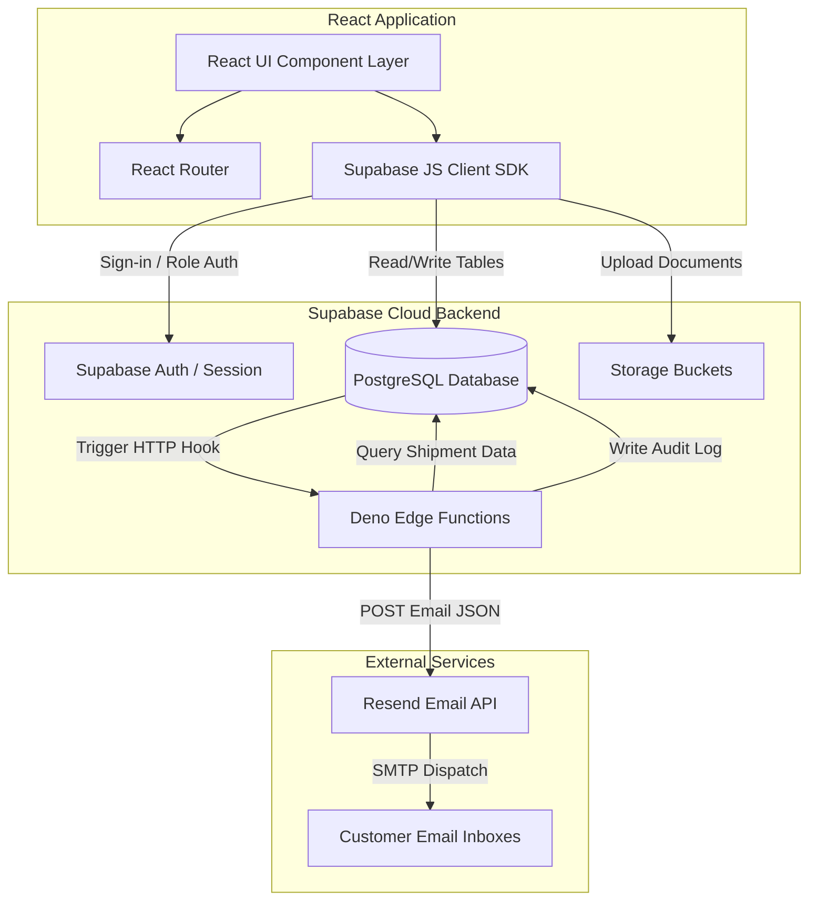

# System Architecture

The **Airway Bill & Document Tracker (AWB-DT)** uses a serverless cloud architecture leveraging React, Supabase, and Resend.

## Architecture Diagram

## Component Breakdown

1. **Vite + React (Frontend)**:
   - Built using React JSX and Tailwind CSS.
   - Leverages a configuration-free **Local Storage Mock Adapter** (in `services/supabase.js`) to emulate all database tables, storage uploading, status transitions, and email notifications in sandbox environments without credentials.
   - Directly connects to Supabase client SDK when `.env` parameters are present.

2. **Supabase Cloud Backend**:
   - **PostgreSQL Database**: Holds tables for `customers`, `shipments`, `shipment_documents`, `status_history`, `alerts`, and `notification_log`. Automatically manages status transitions and volumetric weights via SQL database triggers.
   - **Storage Buckets**: Stores PDF/image compliance documents under private `shipment-documents` bucket pathing conventions (`{shipment_id}/{document_type}.pdf`).
   - **Deno Edge Functions**: Host Deno runtime functions like `send-status-email` to query the DB and dispatch alerts safely.

3. **Resend Email Service**:
   - Integrated via REST API to handle fast email deliveries to shippers and customers using custom templates.
