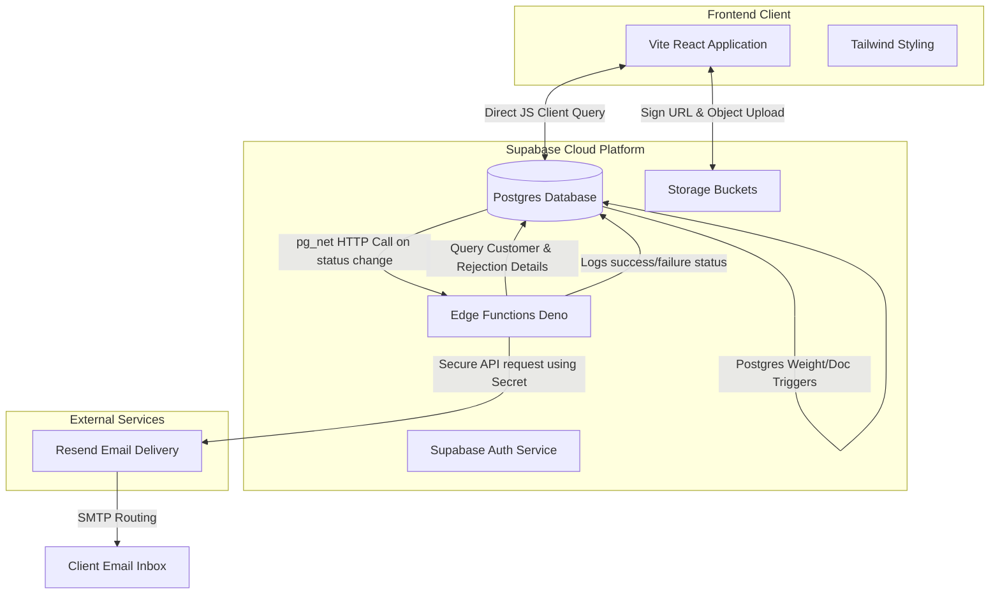

# System Architecture

The ORBEM Solutions Airway Bill & Document Tracker is built as a modern serverless application utilizing a headless backend structure.

## System Breakdown

### 1. Presentation Layer (Vite + React)
- **Direct Queries**: Connects directly to the PostgreSQL database via `@supabase/supabase-js` web client, querying views like `shipments_with_summary` and `dashboard_summary`.
- **Storage Management**: Handles secure binary uploads (Compliance documents like ID proofs, Invoices) directly to Supabase storage buckets and fetches temporary pre-signed 60-second read URLs.

### 2. Business Logic & Persistence Layer (PostgreSQL)
- **Automatic Weight Recalculation**: Triggers evaluate volumetric weight as `(Length * Width * Height) / 6000` and locks chargeable weight.
- **Auto Status Synchronization**: Analyzes the approval/rejection state of the 5 required checklist documents and automatically transitions shipment status between `PENDING_DOCUMENTS`, `ON_HOLD`, and `READY_FOR_HANDOVER`.
- **Status Change Hooks**: Changes in status fire webhook triggers (using `pg_net`) to alert external listeners.

### 3. Edge Alerting Layer (Supabase Edge Functions + Resend)
- **Edge Functions**: Light-weight TypeScript serverless execution environments running on Deno. They are secured with a server-side secret API key.
- **Resend integration**: Sends HTML-formatted operational updates to client and customer emails immediately after database triggers initiate a request.
