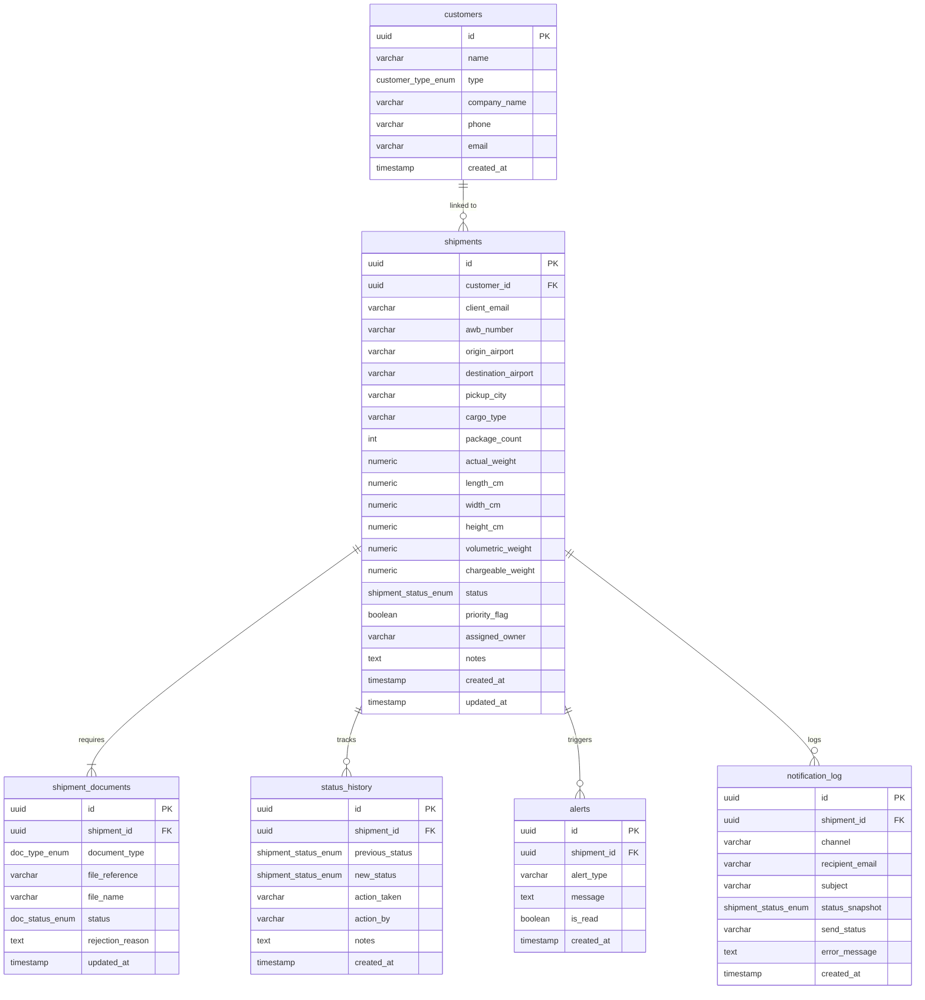

# Entity-Relationship Diagram

This diagram displays the database tables, attributes, primary/foreign keys, and cardinalities in the Supabase PostgreSQL database.

```mermaid
erDiagram
    customers {
        uuid id PK
        varchar name
        customer_type_enum type
        varchar company_name
        varchar phone
        varchar email
        timestamp created_at
    }

    shipments {
        uuid id PK
        uuid customer_id FK
        varchar client_email
        varchar awb_number
        varchar origin_airport
        varchar destination_airport
        varchar pickup_city
        varchar cargo_type
        int package_count
        numeric actual_weight
        numeric length_cm
        numeric width_cm
        numeric height_cm
        numeric volumetric_weight
        numeric chargeable_weight
        shipment_status_enum status
        boolean priority_flag
        varchar assigned_owner
        text notes
        timestamp created_at
        timestamp updated_at
    }

    shipment_documents {
        uuid id PK
        uuid shipment_id FK
        doc_type_enum document_type
        varchar file_reference
        varchar file_name
        doc_status_enum status
        text rejection_reason
        timestamp updated_at
    }

    status_history {
        uuid id PK
        uuid shipment_id FK
        shipment_status_enum previous_status
        shipment_status_enum new_status
        varchar action_taken
        varchar action_by
        text notes
        timestamp created_at
    }

    alerts {
        uuid id PK
        uuid shipment_id FK
        varchar alert_type
        text message
        boolean is_read
        timestamp created_at
    }

    notification_log {
        uuid id PK
        uuid shipment_id FK
        varchar channel
        varchar recipient_email
        varchar subject
        shipment_status_enum status_snapshot
        varchar send_status
        text error_message
        timestamp created_at
    }

    customers ||--o{ shipments : "linked to"
    shipments ||--|{ shipment_documents : "requires"
    shipments ||--o{ status_history : "tracks"
    shipments ||--o{ alerts : "triggers"
    shipments ||--o{ notification_log : "logs"
```
