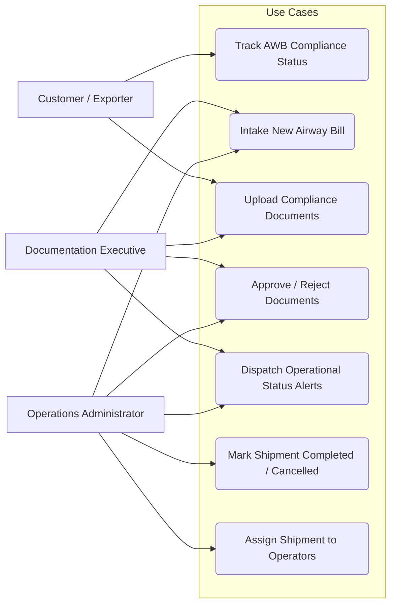

# Use Case Diagram

This use case diagram models the operational actions of each user role in the ORBEM Solutions Airway Bill & Document Tracker.

## Actor Definitions

### 1. Customer / Walk-in Exporter
- **Track Status**: Enters AWB number to check document checklist and audit completion rate in real-time.
- **Upload Documents**: Uploads missing ID proof, packing lists, invoices, and declarations if requested by the documentation team.

### 2. Documentation Executive (Employee)
- **Shipment Intake**: Enters dimensions, weights, pickup locations, and client contact email details.
- **Auditing**: Performs document checklist reviews, approving matching paperwork or rejecting incorrect files with a required explanation.
- **Alerting**: Dispatches manual alerts or reviews automated logs.

### 3. Operations Administrator (Admin)
- **System Control**: Has administrative override control to change status transitions, assign tasks to executives, cancel shipments, or mark consignments as completed.
