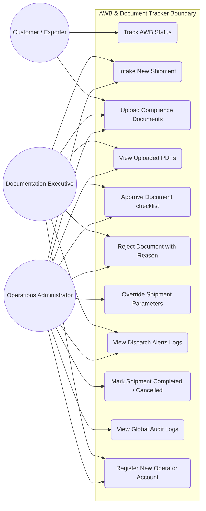

# Use Case Diagram

This use case diagram details the interactions between the system actors (Customer/Exporter, Documentation Executive/Employee, Operations Administrator) and the platform functionalities.

